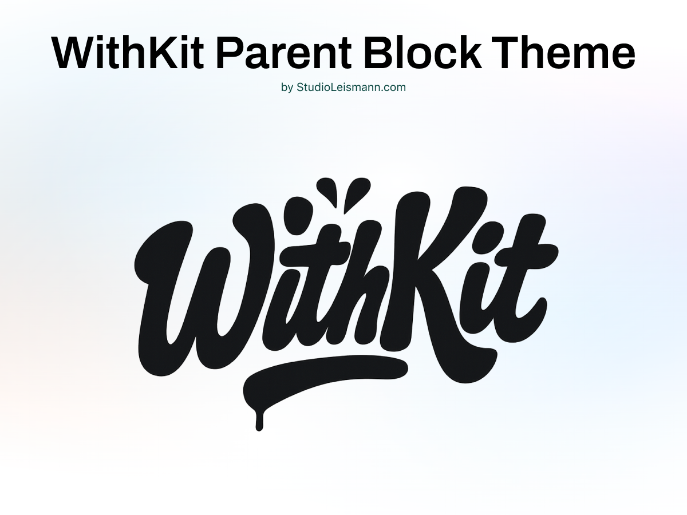

# withkit Block Theme



This repository contains the **withkit** WordPress block theme by
[Studio Leismann](https://studioleismann.com). Besides the regular theme
files, it includes a small build system and a set of utilities that extend the
block editor. All CSS util classes have the prefix `with-`. 

## Getting Started

### Prerequisites

- WordPress 6.6 or later
- Node.js LTS (16+)

### Installation

1. Install the Node dependencies:
   ```bash
   npm install
   ```
2. Build the assets for production:
   ```bash
   npm run build
   ```
   During development you can run the watcher:
   ```bash
   npm start
   ```
3. Copy the theme directory into your WordPress installation (or clone the repo
   inside `wp-content/themes/`) and activate it from the dashboard.

Additional commands:

- `npm run lint:css` – run Stylelint over the SCSS sources.
- `npm run lint:js` – run ESLint on the JavaScript sources.
- `npm run zip` – create a distributable `withkit.zip` in the repository root.

## Repository Structure

- **assets/** – Source fonts and images.
- **build/** – Compiled CSS, JS and optimised images generated by Webpack.
- **inc/** – PHP files loaded from `functions.php`:
  - `setup.php` – theme setup and editor styles.
  - `enqueuing.php` – loads scripts and styles and only enqueues CSS for blocks that appear on the page.
  - `block-variations.php` – example block variations.
  - `block-styles.php` – registers custom style variations for core blocks.
  - `block-patterns.php` – registers pattern categories and disables remote patterns.
  - `dashboard-widget.php` – adds a dashboard widget with theme and server information.
  - `dev_*` files – development helpers such as purging the pattern cache and removing default palettes.
- **parts/** – Template parts (headers, footers, etc.).
- **patterns/** – Block patterns organised in folders.
- **templates/** – Page templates (`home.html`, `front-page.html`, …).
- **styles/** – Additional JSON style variations for blocks, parts and sections.
- **src/** – Source files for SCSS and JavaScript that feed the build.
- **theme.json** – Global theme settings for the block editor.
- **style.css** – Theme header and basic information (version is automatically updated during the build).

## Custom Utilities and Features

- **Utility classes panel** – `inc/dev_helpers.php` parses
  `src/scss/utilities/helpers.scss` and provides a panel inside the block editor
  where you can toggle helper classes for the selected block.
- **Dashboard widget** – Shows theme details and server information in the
  WordPress dashboard (`inc/dashboard-widget.php`).
- **Dynamic block CSS loading** – Only the CSS for blocks and style variations
  actually used on a page is enqueued (`inc/enqueuing.php`).
 - **Block style variations** – Extra styles such as `ghost` buttons or `picture-frame` images are registered in `inc/block-styles.php` and compiled from `src/scss/block-styles/`.
 - **Pattern management** – Core patterns are disabled and custom categories are registered (`inc/block-patterns.php`).
 - **Front‑end scripts** – `src/js/scripts/` includes behaviours like a fixed header (`header-fixed.js`) and draggable stickers (`sticker.js`).

When development helpers in `inc/dev_*.php` are enabled you can purge the theme
cache or remove the default color palettes with dedicated requests.

## Extending the Theme

### Block Style Variations

Register new block styles in `inc/block-styles.php`. Each variation gets its own
folder inside `src/scss/blocks` with a file named after the block and prefixed by
`core-`. For example, the indicator style for the paragraph block lives at
`src/scss/blocks/indicator/core-paragraph.scss`.

### Template Parts

`withkit` ships with multiple template parts such as `footer-wide` and
`footer-centered`. To add another part:

1. Create an HTML file in the `parts/` folder and reference a pattern from it.
2. Add the corresponding pattern file inside `patterns/`.
3. Register the part in `theme.json`.

### Patterns

Custom pattern categories are registered in `inc/block-patterns.php`. If a
pattern does not show up, set `WP_DEVELOPMENT_MODE` to `theme` or `all`, or purge
the cache via `/wp-admin/?purge-theme-cache`.

### Block Variations

Additional block variations are loaded from `inc/block-variations.php`.

## License

withkit is released under the [GPLv2](LICENSE).
